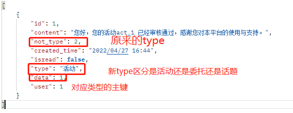

# 委托相关接口

#### 约定后端返回的response

response.status字段代表状态，2\*\*一般为成功，4\*\*一般为失败

response.data字段代表返回数据内容


#### 约定前端提交的request

提交方法包括但不限于get，post

put方法可以用于修改相关信息的请求方法

delete方法可以用于删除相关信息的请求方法

`ps`：put和delete方法如果使用请在文档里更新且删去本条提示。

## 1. 委托搜索

### 全局模糊匹配

- url: api/commission/search/all/
- post:
  - 查询所有类别指定“info”委托


```json
{
    "info": String				// 搜索内容
}
```

或者

- get:
  - 查询所有类别所有委托

- respond:

```json
{
  "status": int,
  "data": [
      {
          "id": bigint,
          "commission_type":{
              "id": int,
              "name": str
          },
          "name": text,
          "start_time": str,
          "end_time": str,
          "create_at": str,
          "real_time": int,
          "user": {
              "id": int,
              "nickName": str,
              "avatarUrl": str,
              "email": str,
              "age": int,
              "gender": int,
              "audit_status": int,
              "is_staff": int,
          },
          "location": int,
          "status": int,
          "description": text,
          "audit": int,
          "fee": int,
      },
      // ...
  ]
}
```


### 针对特定类别模糊匹配

- url: api/commission/search/specific/<sort>
- post:
  - 查询指定类别指定“info”委托

```json
{
    "info": String					// 搜索内容
}
```

或者

- get:
  - 查询指定类别所有委托

- respond:

```json
{
  "status": int,
  "data": [
      {
          "id": bigint,
          "commission_type":{
              "id": int,
              "name": str
          },
          "name": text,
          "start_time": str,
          "end_time": str,
          "create_at": str,
          "real_time": int,
          "user": {
              "id": int,
              "nickName": str,
              "avatarUrl": str,
              "email": str,
              "age": int,
              "gender": int,
              "audit_status": int,
              "is_staff": int,
          },
          "location": int,
          "status": int,
          "description": text,
          "audit": int,
          "fee": int,
      },
      // ...
  ]
}
```


### 委托筛选（可用于日程表获取委托）

- url：api/condition/commissions/

- post：

  ```
  可以包括以下任意值
          {
              "user_id": int,  //创建者
              "user_accept": int,  //接收者
              "commission_type":{
                  "methods": str,          //id or name
                  "values":[]
              },
              "location": int,
              "status": int,
              "audit": int,
              "start_time_timerange": {
                  "start": str,
                  "end": str
              }
              ...
          }
  ```

- respond:

  ```json
  {
    "status": int,
    "data": [
        {
            "id": bigint,
            "commission_type":{
                "id": int,
                "name": str
            },
            "name": text,
            "start_time": str,
            "end_time": str,
            "create_at": str,
            "real_time": int,
            "user": {
                "id": int,
                "nickName": str,
                "avatarUrl": str,
                "email": str,
                "age": int,
                "gender": int,
                "audit_status": int,
                "is_staff": int,
            },
            "location": int,
            "status": int,
            "description": text,
            "audit": int,
            "fee": int,
        },
        // ...
    ]
  }
  ```
  


## 2. 历史搜索记录

~~小程序本地保存历史搜索列表，用户点击某条记录即可调用委托搜索全局模糊匹配指定“info”委托接口。~~

- url: api/commission/search/history/
- get:

- respond:

```json
{
    "status": int,
    "data":[
        {
           "keyword": str,
           "search_time": str
        },
        ...
    ]
}
```


## 3. 委托类别查看

调用针对特定类别模糊匹配查询特定类别所有委托接口。


## 4. 委托展示

小程序前端，无接口。


## 5. 委托推荐

- url: api/commission/search/recommend/
- get:

- respond:

```json
{
  "status": int,
  "data": [
      {
          "id": bigint,
          "commission_type":{
              "id": int,
              "name": str
          },
          "name": text,
          "start_time": str,
          "end_time": str,
          "create_at": str,
          "real_time": int,
          "user": {
              "id": int,
              "nickName": str,
              "avatarUrl": str,
              "email": str,
              "age": int,
              "gender": int,
              "audit_status": int,
              "is_staff": int,
          },
          "location": int,
          "status": int,
          "description": text,
          "audit": int,
          "fee": int,
      },
      // ...
  ]
}
```


## 6. 委托介绍

用户点击进入详细界面

- url: api/commission/detail/
- post:

```json
{
    "commission_id": bigint					// 委托id
}
```


- respond:

```json
{
  "status": int,
  "data": [
      {
          "id": bigint,
          "commission_type":{
              "id": int,
              "name": str
          },
          "name": text,
          "start_time": str,
          "end_time": str,
          "create_at": str,
          "real_time": int,
          "user": {
              "id": int,
              "nickName": str,
              "avatarUrl": str,
              "email": str,
              "age": int,
              "gender": int,
              "audit_status": int,
              "is_staff": int,
          },
          "location": int,
          "status": int,
          "description": text,
          "audit": int,
          "fee": int,
          // 以上为基础信息
          "comments": [
              {
                  "id": int,
                  "user":{
                      "id":int,
                      "nickName":str
                  },
                  "to_user":{
                      "id":int,
                      "nickName":str
                  },
                  "comment": text,
                  "comment_time":str,
              },
              // ...
          ],
          "score": int
          // TODO 待完善
      }
      // ...
  ]
}
```


## 7. 委托申请

- url: api/commission/apply/
- post:

```json
{
    "commission_id": bigint,
}
```


- respond:

```json
{
  	"status": int
}
```


## 8. 查看已申请的委托

- url: api/commission/applied/<Status>		此处status代表已申请和已完成
- get:

- respond:

```json
{
  "status": int,
  "data": [
      {
          "commission" :{
          		"id": bigint,
          		"commission_type":{
              		"id": int,
              		"name": str
          		},
          		"name": text,
          		"start_time": str,
          		"end_time": str,
          		"create_at": str,
          		"real_time": int,
          		"user": {
              		"id": int,
              		"nickName": str,
              		"avatarUrl": str,
              		"email": str,
              		"age": int,
              		"gender": int,
              		"audit_status": int,
              		"is_staff": int,
          		},
          		"location": int,
          		"status": int,
          		"description": text,
          		"audit": int,
          		"fee": int,
			},
          	"apply_time": str,
      },
      // ...
  ]
}
```


## 9. 委托终止

- url: api/commission/terminate/
- post:

```json
{
    "commission_id": bigint
}
```


- respond:

```json
{
  	"status": int,
}
```


## 10. 委托放弃

- url: api/commission/drop/
- post:

```json
{
    "commission_id": bigint	
}
```


- respond:

```json
{
  	"status": int,
}
```


## 11. 委托评分相关

##### 评分

- url: api/commission/score/
- post:

```json
{
    "commission_id": bigint,
    "score": int
}
```

- respond:

```json
{
  	"status": int,
}
```

##### 删除评分

- url: api/commission/score/
- delete:

```json
{
    "commission_id": bigint
}
```

- respond:

```json
{
  	"status": int,
}
```


## 12. 委托评论相关

##### 发布评论

- url: api/commission/comment/
- post:

```json
{
    "commission_id": bigint,
    "to_comment_id": bigint,		//若无则不传，无则代表为一级评论，有则代表二级评论
    "to_user_id": bigint,			//若无则不传，且只有当to_comment_id不为空才能传，不为空时也可以不传
    "comment": text
}
```

- respond:

```json
{
  	"status": int,
}
```

##### 根据评论id获取一级评论

- url: api/commission/comment/<id>/
- get:

- respond:

```json
{
  	"status": int,
    "data":{
        "id": int,
        "commission":{
            "id":int,
            "name": str
        },
        "user": {
            "id": int,
            "nickName": str,
            "avatarUrl": str,
        },
        "comment_time": str,
        "comment": text,
        "reply": [
            {
                "id": int,
                "to_comment_id": int,
        		"user": {
        		    "id": int,
        		    "nickName": str,
        		    "avatarUrl": str,
        		},
                "to_user": {				//	可以不存在
        		    "id": int,
        		    "nickName": str,
        		    "avatarUrl": str,
        		},
        		"comment_time": str,
        		"comment": text,
            },
            ...
        ]
    }
}
```

##### 根据评论id删除一级评论

- url: api/commission/comment/<id>/
- delete:

- respond:

```json
{
  	"status": int
}
```

##### 根据委托id获取全部一级评论

- url: api/comment_commissions/<com_id>/
- get:

- respond:

```json
{
  	"status": int,
    "data":
    [
    {
        "id": int,
        "commission":{
            "id":int,
            "name": str
        },
        "user": {
            "id": int,
            "nickName": str,
            "avatarUrl": str,
        },
        "comment_time": str,
        "comment": text,
        "reply": [
            {
                "id": int,
                "to_comment_id": int,
        		"user": {
        		    "id": int,
        		    "nickName": str,
        		    "avatarUrl": str,
        		},
                "to_user": {				//	可以不存在
        		    "id": int,
        		    "nickName": str,
        		    "avatarUrl": str,
        		},
        		"comment_time": str,
        		"comment": text,
            },
            ...
        ]
    },
    ...
   	]
}
```


## 13. 委托发布

​		

- url: api/commission/publish/
- post:

```json
{
    "commission_type": bigint,
    "name": text,
    "start_time": str,
    "end_time": str,
    "real_time": int,
    "location": int,
    "description": text,
    "fee": int,
    "tags":[
        {"name":"新主楼"}
        ...]
}
```


- respond:

```json
{
  	"status": int,
}
```

## 14. 已发布委托的查看、修改和删除

### 查看全部

- url: api/commission/check/<Status>			此处status代表已通过和未通过
- get

- respond:

```json
{
  "status": int,
  "data": [
      {
          "id": bigint,
          "commission_type":{
              "id": int,
              "name": str
          },
          "name": text,
          "start_time": str,
          "end_time": str,
          "create_at": str,
          "real_time": int,
          "user": {
              "id": int,
              "nickName": str,
              "avatarUrl": str,
              "email": str,
              "age": int,
              "gender": int,
              "audit_status": int,
              "is_staff": int,
          },
          "location": int,
          "status": int,
          "description": text,
          "audit": int,
          "fee": int,
      },
      // ...
  ]
}
```

### 查看单个委托

同委托介绍

### 修改

- url: api/commission/check/<id>
- put


```json
{
    "id": bigint,
    "commission_type":{
        "id": int,
        "name": str
    },
    "name": text,
    "start_time": str,
    "end_time": str,
    "create_at": str,
    "real_time": int,
    "location": int,
    "status": int,
    "description": text,
    "fee": int,
}
```

- respond:

```json
{
  	"status": int,
}
```


### 删除(用于管理端审核删除)

- url: api/commission/check/<id>
- delete

- respond:

```json
{
  	"status": int,
}
```

## 15. 委托完成

- url: api/commission/finish/
- post:

```json
{
    "commission_id": bigint
}
```

- respond:

```json
{
  	"status": int
}
```


## 16.系统通知相关

这个接口主要是修改原有的接口

notification/*

修改内容如下：



其中not_type对应的为原来的type（对照原来的前端代码）

```
日程提醒 = 1
系统通知 = 2
活动推荐 = 3
订阅提醒 = 4
评论回复 = 5
委托评分 = 6
.
.
.
//todo
```


## 17. 委托类别获取

- url: api/commission/sort/
- get:

- respond:

```json
{
  	"status": int,
    "data":[{
        "id": int,
        "name": str,
        "image": url
        },
        ...
    ]
}
```


### ps：状态列表

```
location:
学院路 = 1
沙河 = 2

real_time:
实时 = 1
非实时 = 2

status:
已发布 = 1
已申请 = 2
//修改
//接口实现？？？
申请完成 = 3
确认完成 = 4

audit:
审核通过 = 1
审核失败 = 2
```

